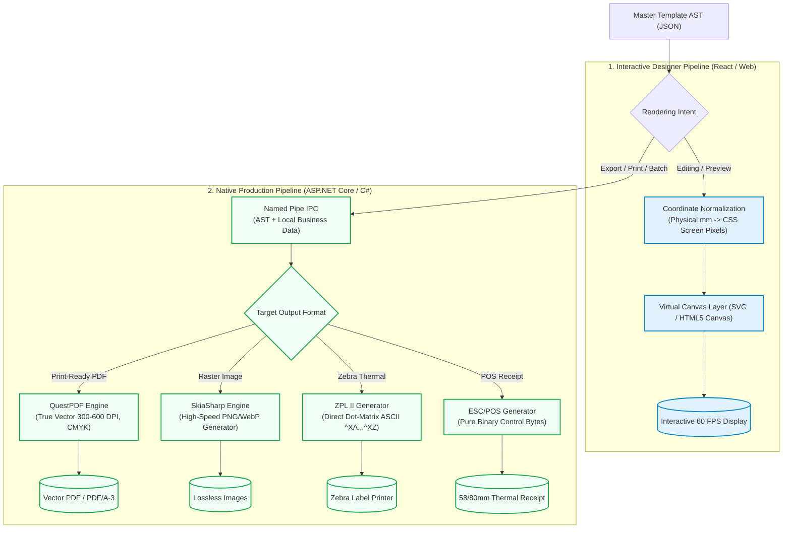

# Universe Template Studio (UTS)
## Technical Blueprint: Architecture, Folder Structure, Database Schemas & Rendering Strategy

**Document Version:** 2.0.0  
**Target Systems:** Desktop (Windows 10/11, macOS, Linux) & Cloud License Server  
**Classification:** Engineering Architecture & Design Document  

---

## 1. System Architecture & Component Interaction

Universe Template Studio adopts a **Decoupled Local-First Desktop Architecture** coupled with a **Zero-Knowledge Cloud Licensing Authority**.

```mermaid
graph TB
    subgraph Client_Desktop ["Local Desktop Environment (Zero-Cloud Boundary)"]
        subgraph Electron_Shell ["Electron Shell Process Layer"]
            MainProc["Electron Main Process<br/>(Node.js / Lifecycle / Menu / Updates)"]
            Preload["Preload Context Bridge<br/>(Hardened IPC / contextIsolation: true)"]
            Supervisor["Process Supervisor & Watchdog<br/>(Spawns & Monitors Native Core)"]
        end

        subgraph Renderer_UI ["Renderer Viewport Layer (Chromium)"]
            ReactUI["React 18 Studio App<br/>(Zustand / Tailwind / Shadcn)"]
            CanvasEngine["WYSIWYG Canvas Engine<br/>(Fabric.js / HTML5 Canvas / SVG Virtualization)"]
            ExpressionEngine["Client Expression Evaluator<br/>(Formula Parsing & Mock Preview)"]
        end

        subgraph Native_Sidecar ["Native High-Performance Core (Local Loopback)"]
            AOT_Server["ASP.NET Core .NET 8 AOT Host<br/>(Kestrel Local Loopback / Named Pipes)"]
            QuestPDF_Compiler["QuestPDF Vector Compiler<br/>(300-600 DPI Print-Ready Documents)"]
            Skia_Rasterizer["SkiaSharp Engine<br/>(High-Speed Image Rasterization)"]
            Thermal_Spooler["Raw Thermal Spooler<br/>(ZPL II & ESC/POS Command Generator)"]
            OS_Spooler["Direct OS Print Bridge<br/>(Win32 GDI / CUPS Raw Stream)"]
        end

        subgraph Local_Storage ["Local Persistence Layer (On-Disk)"]
            SQLite_DB[("SQLite 3 + SQLCipher<br/>(AES-256 Encrypted Store)")]
            Template_FS[("File System Cache<br/>(.uts Archives, TTF/OTF Fonts, Assets)")]
        end

        ReactUI --> CanvasEngine
        ReactUI --> ExpressionEngine
        ReactUI <-->|Typed IPC| Preload
        Preload <-->|Secure Channel| MainProc
        MainProc --> Supervisor
        Supervisor -->|Spawn / Restart / Health Check| AOT_Server
        MainProc <-->|Local Loopback / Named Pipe| AOT_Server
        MainProc <-->|Local SQL| SQLite_DB
        MainProc <-->|I/O| Template_FS

        AOT_Server --> QuestPDF_Compiler
        AOT_Server --> Skia_Rasterizer
        AOT_Server --> Thermal_Spooler
        Thermal_Spooler --> OS_Spooler
        QuestPDF_Compiler --> OS_Spooler
    end

    subgraph Cloud_Authority ["Central Licensing Authority (Zero Customer Data)"]
        Lic_API["Licensing Microservice<br/>(ASP.NET Core 8 Web API)"]
        Pg_DB[("PostgreSQL 16 Database<br/>(HWID Vault, Key Registry, Activations)")]
        Lic_API <--> Pg_DB
    end

    MainProc -.->|HTTPS Mutual TLS 1.3<br/>(HWID Hash & License Token ONLY)| Lic_API

    classDef client fill:#e8f5e9,stroke:#2e7d32,stroke-width:2px;
    classDef native fill:#e1f5fe,stroke:#0277bd,stroke-width:2px;
    classDef cloud fill:#fbe9e7,stroke:#d84315,stroke-width:2px;
    class ReactUI,CanvasEngine,ExpressionEngine,MainProc,Preload,Supervisor,SQLite_DB,Template_FS client;
    class AOT_Server,QuestPDF_Compiler,Skia_Rasterizer,Thermal_Spooler,OS_Spooler native;
    class Lic_API,Pg_DB cloud;
```

### 1.1 Architectural Principles
1. **Separation of Concerns:**
   - **React/Electron:** Focuses on human interaction, rapid UI rendering, drag-and-drop mechanics, layout editing, property matrices, and template design.
   - **ASP.NET Core Sidecar:** Focuses strictly on computational heavy lifting: vector math, font metrics compilation, CMYK PDF export, raw thermal byte generation, and 10,000+ document batch generation.
2. **IPC Protocol:**
   - **Windows:** Named Pipes (`\\.\pipe\uts-core-{SessionSecret}`).
   - **Linux / macOS:** Unix Domain Sockets (`/var/run/uts/uts-core-{SessionSecret}.sock`).
   - Every IPC request carries an HMAC session token generated on Electron startup.
3. **Data Isolation:**
   - No customer database connection strings, customer records, invoice items, or generated documents leave the client machine.
   - Network calls from the Chromium renderer are blocked at the kernel/process level via Content Security Policy (`connect-src 'none'`).

---

## 2. Production Monorepo Folder Structure

The project is structured as a scalable, modern **Nx / Turbo-style Monorepo**, maintaining clean boundary separation between the desktop UI, native sidecar, shared contracts, and the remote licensing server.

```
universe-template-studio/
├── .github/                                # CI/CD Workflows & Build Pipelines
│   ├── workflows/
│   │   ├── desktop-build.yml               # Windows MSIX, macOS DMG, Linux AppImage builds
│   │   ├── native-sidecar-aot.yml          # .NET 8 Native AOT cross-compilation
│   │   └── license-server-deploy.yml       # Dockerized PostgreSQL/API deployment
├── apps/
│   ├── desktop/                            # Electron Desktop Wrapper (Main & Preload)
│   │   ├── src/
│   │   │   ├── main/
│   │   │   │   ├── index.ts                # App lifecycle, single instance lock, window manager
│   │   │   │   ├── sidecar-supervisor.ts   # Spawns, health-checks, restarts C# sidecar
│   │   │   │   ├── ipc-handlers.ts         # Secure IPC bridges (file, dialog, sidecar relay)
│   │   │   │   ├── local-store.ts          # SQLite / SQLCipher database manager
│   │   │   │   ├── print-manager.ts        # OS print dialog and direct spooler access
│   │   │   │   └── license-client.ts       # Cryptographic Ed25519 token verifier & client HWID
│   │   │   ├── preload/
│   │   │   │   ├── index.ts                # Context isolation bridge (window.utsAPI)
│   │   │   │   └── types.ts                # Strongly typed bridge contracts
│   │   │   └── assets/                     # App icons, tray icons, splash screens
│   │   ├── electron-builder.yml            # Code signing, installer configs (NSIS, DMG)
│   │   ├── package.json
│   │   └── tsconfig.json
│   │
│   ├── studio-ui/                          # Frontend React WYSIWYG Application
│   │   ├── src/
│   │   │   ├── components/
│   │   │   │   ├── canvas/                 # Core Canvas Viewport
│   │   │   │   │   ├── CanvasViewport.tsx  # Main interactive SVG/Canvas container
│   │   │   │   │   ├── Rulers.tsx          # Sub-millimeter interactive metric/imperial rulers
│   │   │   │   │   ├── GridOverlay.tsx     # Magnetic grid, snap lines, guide markers
│   │   │   │   │   ├── TransformHandle.tsx # Bounding-box resize/rotate handles
│   │   │   │   │   └── SelectionBox.tsx    # Multi-element lasso selection box
│   │   │   │   ├── toolbox/                # Drag-and-drop component palette
│   │   │   │   │   ├── ToolboxPanel.tsx
│   │   │   │   │   ├── ToolItem.tsx
│   │   │   │   │   └── items/              # Text, Barcode, QR, Image, Table, Line, Shape
│   │   │   │   ├── inspector/              # Right-hand property inspector
│   │   │   │   │   ├── InspectorPanel.tsx
│   │   │   │   │   ├── GeometrySection.tsx # X, Y, W, H, Rotation, Z-Index, Lock
│   │   │   │   │   ├── StyleSection.tsx    # Typography, Fill, Stroke, Padding, Border
│   │   │   │   │   ├── BindingSection.tsx  # Dynamic field mapping & expressions
│   │   │   │   │   └── VisibilityRule.tsx  # Conditional rendering rules
│   │   │   │   ├── modals/                 # Data source configuration, Page setup, Export dialog
│   │   │   │   └── common/                 # Buttons, Inputs, ColorPicker, Tooltips
│   │   │   ├── engine/                     # Client-side canvas logic & algorithms
│   │   │   │   ├── canvas-math.ts          # Unit conversion (mm/in/px), DPI scaling, matrix transforms
│   │   │   │   ├── snap-engine.ts          # Snapping calculations (edge-to-edge, center-to-center)
│   │   │   │   ├── undo-redo-manager.ts    # History stack with delta compression
│   │   │   │   └── formula-parser.ts       # In-memory formula evaluation (Sum, Concat, Format)
│   │   │   ├── store/                      # Zustand State Management
│   │   │   │   ├── useTemplateStore.ts     # Active AST state, elements, page geometry
│   │   │   │   ├── useSelectionStore.ts    # Active selection, multi-select IDs, hover state
│   │   │   │   ├── useUIStore.ts           # Zoom level, pan offset, grid toggle, theme
│   │   │   │   └── useDataSourceStore.ts   # Mock JSON data, schema fields, active sample row
│   │   │   ├── hooks/                      # Custom React hooks (useHotkeys, useClipboard, useZoom)
│   │   │   ├── styles/                     # Tailwind CSS, global themes, font definitions
│   │   │   ├── App.tsx
│   │   │   ├── main.tsx
│   │   │   └── index.html
│   │   ├── vite.config.ts
│   │   ├── package.json
│   │   └── tsconfig.json
│   │
│   ├── services/
│   │   ├── uts-native-core/                # ASP.NET Core .NET 8 AOT Native Sidecar
│   │   │   ├── src/
│   │   │   │   ├── Program.cs              # AOT host startup, Named Pipe / Loopback server
│   │   │   │   ├── Controllers/            # IPC endpoints (Compile, Rasterize, PrintDirect)
│   │   │   │   ├── Compilation/            # Document compilation pipeline
│   │   │   │   │   ├── DocumentCompiler.cs # Main entry point orchestrating AST to output
│   │   │   │   │   ├── QuestPdfEngine.cs   # QuestPDF vector layout & PDF/A generator
│   │   │   │   │   ├── SkiaRasterEngine.cs # SkiaSharp high-speed image rasterizer
│   │   │   │   │   └── FontResolver.cs     # Embedded TTF/OTF font loading & glyph fallback
│   │   │   │   ├── Thermal/                # Thermal printer raw command generation
│   │   │   │   │   ├── ZplBuilder.cs       # Zebra Programming Language II command generator
│   │   │   │   │   ├── EscPosBuilder.cs    # EPSON POS binary command generator (58mm/80mm)
│   │   │   │   │   └── RawSpooler.cs       # Direct OS print spooler wrapper (Win32 / CUPS)
│   │   │   │   ├── Models/                 # Strongly typed C# AST models matching JSON schema
│   │   │   │   │   ├── TemplateAst.cs
│   │   │   │   │   ├── ElementDefinition.cs
│   │   │   │   │   └── RenderOptions.cs
│   │   │   │   └── Security/
│   │   │   │       └── SessionTokenValidator.cs # Validates local IPC token handshake
│   │   │   ├── uts-native-core.csproj      # Configured for PublishAot=true
│   │   │   └── appsettings.json
│   │   │
│   │   └── license-server/                 # Central Cloud Licensing Microservice
│   │       ├── src/
│   │       │   ├── Controllers/            # /api/v1/licenses/activate, /verify, /offline-req
│   │       │   ├── Domain/                 # Entities (Organization, License, Activation, HWID)
│   │       │   ├── Infrastructure/         # EF Core DbContext, PostgreSQL repositories
│   │       │   ├── Cryptography/           # Ed25519 asymmetric signature issuing engine
│   │       │   └── Migrations/             # PostgreSQL database migrations
│   │       ├── Dockerfile
│   │       └── license-server.csproj
│
├── packages/                               # Shared Libraries & Contracts
│   ├── schema/                             # Single Source of Truth for Template AST
│   │   ├── src/
│   │   │   ├── template-ast.json           # JSON Schema v7 specification
│   │   │   ├── types.ts                    # Generated TypeScript interfaces
│   │   │   └── TemplateAst.cs              # Generated C# classes (via NJsonSchema/QuickType)
│   │   ├── package.json
│   │   └── schema.config.json
│   │
│   ├── crypto/                             # Shared Cryptography & HWID Utilities
│   │   ├── src/
│   │   │   ├── hwid.ts                     # Hardware fingerprint generator (Node.js)
│   │   │   ├── ed25519-verifier.ts         # Public-key license token verifier
│   │   │   └── HwidGenerator.cs            # Matching C# HWID generator
│   │   └── package.json
│   │
│   └── shared-ui/                          # Reusable UI Components & Design Tokens
│       ├── src/                            # Icons, color palettes, metric constants
│       └── package.json
│
├── tests/                                  # Integration & Performance Test Suites
│   ├── e2e/                                # Playwright desktop automation tests
│   ├── benchmarks/                         # 10,000-page batch generation benchmarks
│   └── thermal/                            # Mock ZPL / ESC-POS stream visualizer
│
├── package.json                            # Monorepo root package.json (pnpm / npm workspaces)
├── pnpm-workspace.yaml                     # Workspace definition
├── Directory.Build.props                   # Shared .NET build configuration
└── README.md
```

---

## 3. Database Architecture & Schemas

### 3.1 Local Persistence Layer (Client-Side SQLite 3 + SQLCipher)
* **Purpose:** Stores local user templates, revision history, mock data schemas, printer hardware profiles, and cryptographically verified offline license certificates.
* **Encryption:** AES-256 via SQLCipher with key derived from Windows DPAPI / macOS Keychain.

```sql
-- ============================================================================
-- UNIVERSE TEMPLATE STUDIO - LOCAL SQLITE SCHEMA (SQLCIPHER AES-256)
-- ============================================================================

PRAGMA foreign_keys = ON;
PRAGMA journal_mode = WAL;

-- 1. Local Application Configuration & User Preferences
CREATE TABLE IF NOT EXISTS app_preferences (
    key TEXT PRIMARY KEY,
    value TEXT NOT NULL,
    updated_at DATETIME NOT NULL DEFAULT CURRENT_TIMESTAMP
);

-- 2. Local Template Store (Master Template Registry)
CREATE TABLE IF NOT EXISTS templates (
    id TEXT PRIMARY KEY,                       -- UUID v4
    name TEXT NOT NULL,                        -- Human-readable name
    description TEXT,
    category TEXT NOT NULL DEFAULT 'GENERAL',  -- 'INVOICE', 'BARCODE_LABEL', 'SHIPPING', 'RECEIPT'
    page_unit TEXT NOT NULL DEFAULT 'mm',      -- 'mm', 'in', 'pt', 'px'
    page_width REAL NOT NULL,                  -- e.g., 210.0 (A4) or 101.6 (4x6 Label)
    page_height REAL NOT NULL,                 -- e.g., 297.0 or 152.4
    orientation TEXT NOT NULL DEFAULT 'PORTRAIT', -- 'PORTRAIT', 'LANDSCAPE'
    is_deleted INTEGER NOT NULL DEFAULT 0,     -- Soft delete flag
    created_at DATETIME NOT NULL DEFAULT CURRENT_TIMESTAMP,
    updated_at DATETIME NOT NULL DEFAULT CURRENT_TIMESTAMP
);
CREATE INDEX IF NOT EXISTS idx_templates_category ON templates(category);
CREATE INDEX IF NOT EXISTS idx_templates_updated ON templates(updated_at DESC);

-- 3. Template Version Snapshots (Git-like Local History & Undo/Rollback)
CREATE TABLE IF NOT EXISTS template_revisions (
    id INTEGER PRIMARY KEY AUTOINCREMENT,
    template_id TEXT NOT NULL,
    revision_number INTEGER NOT NULL,
    ast_json TEXT NOT NULL,                    -- Full JSON Abstract Syntax Tree
    preview_thumbnail BLOB,                    -- WebP thumbnail buffer
    commit_message TEXT,                       -- e.g. "Added GST QR code to footer"
    created_at DATETIME NOT NULL DEFAULT CURRENT_TIMESTAMP,
    FOREIGN KEY(template_id) REFERENCES templates(id) ON DELETE CASCADE,
    UNIQUE(template_id, revision_number)
);
CREATE INDEX IF NOT EXISTS idx_revisions_template ON template_revisions(template_id, revision_number DESC);

-- 4. Local Data Sources & Mock Schemas (Never Leaves Machine)
CREATE TABLE IF NOT EXISTS local_data_sources (
    id TEXT PRIMARY KEY,
    name TEXT NOT NULL,
    driver_type TEXT NOT NULL,                 -- 'MOCK_JSON', 'CSV_FILE', 'SQLITE_LOCAL'
    file_path TEXT,                            -- Local file path if CSV/SQLite
    schema_fields_json TEXT NOT NULL,          -- JSON Schema of available columns
    sample_payload_json TEXT,                  -- Sample data for in-designer preview
    created_at DATETIME NOT NULL DEFAULT CURRENT_TIMESTAMP
);

-- 5. Hardware Printer Profiles (Calibrated margins, density, direct raw ports)
CREATE TABLE IF NOT EXISTS printer_profiles (
    id TEXT PRIMARY KEY,
    name TEXT NOT NULL,                        -- e.g. "Zebra ZD420 - Warehouse 1"
    printer_type TEXT NOT NULL,                -- 'STANDARD_LASER', 'THERMAL_ZPL', 'THERMAL_ESCPOS'
    os_printer_name TEXT NOT NULL,             -- Name as registered in Windows Spooler
    dpi INTEGER NOT NULL DEFAULT 203,          -- 203, 300, or 600 DPI
    darkness INTEGER DEFAULT 15,               -- Thermal darkness / burn temperature
    feed_offset_mm REAL DEFAULT 0.0,           -- Sub-millimeter label alignment
    tear_off_mode TEXT DEFAULT 'TEAR_OFF',     -- 'TEAR_OFF', 'CUTTER', 'PEEL_OFF'
    is_default INTEGER DEFAULT 0
);

-- 6. Offline Cryptographic License Vault
CREATE TABLE IF NOT EXISTS license_vault (
    id INTEGER PRIMARY KEY CHECK (id = 1),     -- Single active license record
    license_key TEXT NOT NULL,
    tier_id TEXT NOT NULL,                     -- 'COMMUNITY', 'PROFESSIONAL', 'ENTERPRISE'
    license_token TEXT NOT NULL,               -- Digitally signed Ed25519 JWT/Token
    hwid_hash TEXT NOT NULL,                   -- Client machine hash
    issued_at DATETIME NOT NULL,
    expires_at DATETIME,                       -- NULL for lifetime license
    last_verified_at DATETIME NOT NULL DEFAULT CURRENT_TIMESTAMP,
    offline_grace_deadline DATETIME            -- Heartbeat expiration timestamp
);

-- 7. Monotonic Security Audit Log (Tamper-evident Clock Rollback Detection)
CREATE TABLE IF NOT EXISTS security_audit (
    id INTEGER PRIMARY KEY AUTOINCREMENT,
    event_type TEXT NOT NULL,                  -- 'STARTUP', 'LICENSE_CHECK', 'RENDER_BATCH'
    recorded_at DATETIME NOT NULL DEFAULT CURRENT_TIMESTAMP,
    monotonic_counter INTEGER NOT NULL,
    integrity_signature TEXT NOT NULL          -- HMAC check of previous row
);
```

---

### 3.2 Remote Cloud Licensing Database (PostgreSQL 16)
* **Purpose:** Centralized authority for license keys, activations, node-locking, hardware fingerprints, and signature generation. **Stores zero customer operational/business data.**

```sql
-- ============================================================================
-- UNIVERSE TEMPLATE STUDIO - REMOTE POSTGRESQL LICENSING SCHEMA
-- ============================================================================

CREATE EXTENSION IF NOT EXISTS "uuid-ossp";
CREATE EXTENSION IF NOT EXISTS "pgcrypto";

-- 1. Organization & Customer Registry
CREATE TABLE organizations (
    id UUID PRIMARY KEY DEFAULT gen_random_uuid(),
    company_name VARCHAR(255) NOT NULL,
    billing_email VARCHAR(255) UNIQUE NOT NULL,
    is_enterprise_partner BOOLEAN NOT NULL DEFAULT FALSE,
    created_at TIMESTAMPTZ NOT NULL DEFAULT CURRENT_TIMESTAMP
);

-- 2. License Tiers & Entitlements
CREATE TABLE license_tiers (
    id VARCHAR(50) PRIMARY KEY,                -- 'COMMUNITY', 'PRO_SINGLE', 'ENTERPRISE_FLEET'
    display_name VARCHAR(100) NOT NULL,
    max_activations_per_key INT NOT NULL DEFAULT 1,
    allows_thermal_printing BOOLEAN NOT NULL DEFAULT TRUE,
    allows_batch_generation BOOLEAN NOT NULL DEFAULT TRUE,
    allows_airgap_offline BOOLEAN NOT NULL DEFAULT FALSE,
    max_batch_page_limit INT,                  -- NULL = Unlimited
    created_at TIMESTAMPTZ NOT NULL DEFAULT CURRENT_TIMESTAMP
);

-- 3. Master Licenses
CREATE TABLE licenses (
    id UUID PRIMARY KEY DEFAULT gen_random_uuid(),
    license_key VARCHAR(64) UNIQUE NOT NULL,   -- e.g. "UTS-8942-F19A-443B-998C"
    organization_id UUID NOT NULL REFERENCES organizations(id) ON DELETE RESTRICT,
    tier_id VARCHAR(50) NOT NULL REFERENCES license_tiers(id),
    status VARCHAR(20) NOT NULL DEFAULT 'ACTIVE', -- 'ACTIVE', 'SUSPENDED', 'REVOKED', 'EXPIRED'
    created_at TIMESTAMPTZ NOT NULL DEFAULT CURRENT_TIMESTAMP,
    expires_at TIMESTAMPTZ,                    -- NULL = Perpetual license
    max_activations INT NOT NULL DEFAULT 1
);
CREATE INDEX idx_licenses_lookup ON licenses(license_key, status);

-- 4. Node-Locked Device Activations (Hardware Binding)
CREATE TABLE device_activations (
    id UUID PRIMARY KEY DEFAULT gen_random_uuid(),
    license_id UUID NOT NULL REFERENCES licenses(id) ON DELETE CASCADE,
    hwid_hash VARCHAR(64) NOT NULL,            -- SHA-256 hash of CPU + Motherboard UUID
    friendly_machine_name VARCHAR(100),        -- e.g. "Counter-01-POS"
    os_platform VARCHAR(50),                   -- "WINDOWS_11_X64", "MACOS_ARM64"
    client_version VARCHAR(20) NOT NULL,       -- e.g. "1.0.0"
    last_heartbeat TIMESTAMPTZ NOT NULL DEFAULT CURRENT_TIMESTAMP,
    is_active BOOLEAN NOT NULL DEFAULT TRUE,
    activated_at TIMESTAMPTZ NOT NULL DEFAULT CURRENT_TIMESTAMP,
    CONSTRAINT uq_license_hwid UNIQUE(license_id, hwid_hash)
);
CREATE INDEX idx_activations_heartbeat ON device_activations(last_heartbeat);

-- 5. Cryptographic Signing Keys (Ed25519 Key Ring)
CREATE TABLE signing_keys (
    key_id VARCHAR(50) PRIMARY KEY,            -- e.g. "uts-ed25519-v1"
    public_key_pem TEXT NOT NULL,              -- Distributed inside client app binary
    private_key_encrypted TEXT NOT NULL,       -- Encrypted with HSM / KMS master key
    is_active BOOLEAN NOT NULL DEFAULT TRUE,
    rotated_at TIMESTAMPTZ
);

-- 6. Offline Air-Gapped Activation Tickets
CREATE TABLE offline_activation_tickets (
    id UUID PRIMARY KEY DEFAULT gen_random_uuid(),
    license_id UUID NOT NULL REFERENCES licenses(id) ON DELETE CASCADE,
    request_payload_hash VARCHAR(64) NOT NULL,
    issued_license_token TEXT NOT NULL,        -- Signed Ed25519 license certificate
    issued_by_admin VARCHAR(255),
    created_at TIMESTAMPTZ NOT NULL DEFAULT CURRENT_TIMESTAMP
);
```

---

### 3.3 Template AST JSON Schema (v1.0 Standard)

Every template in Universe Template Studio is serialized into a deterministic, version-controlled **Abstract Syntax Tree (AST)**:

```json
{
  "$schema": "https://json-schema.org/draft-07/schema#",
  "title": "UniverseTemplateAst",
  "type": "object",
  "required": ["schemaVersion", "metadata", "pageSettings", "dataSchema", "layers"],
  "properties": {
    "schemaVersion": { "type": "string", "enum": ["1.0.0"] },
    "metadata": {
      "type": "object",
      "required": ["id", "title", "createdAt", "updatedAt"],
      "properties": {
        "id": { "type": "string", "format": "uuid" },
        "title": { "type": "string" },
        "description": { "type": "string" },
        "category": { "type": "string" },
        "createdAt": { "type": "string", "format": "date-time" },
        "updatedAt": { "type": "string", "format": "date-time" }
      }
    },
    "pageSettings": {
      "type": "object",
      "required": ["unit", "width", "height", "orientation", "margins"],
      "properties": {
        "unit": { "type": "string", "enum": ["mm", "in", "pt", "px"] },
        "width": { "type": "number", "minimum": 1 },
        "height": { "type": "number", "minimum": 1 },
        "orientation": { "type": "string", "enum": ["portrait", "landscape"] },
        "margins": {
          "type": "object",
          "properties": {
            "top": { "type": "number" },
            "bottom": { "type": "number" },
            "left": { "type": "number" },
            "right": { "type": "number" }
          }
        },
        "targetDpi": { "type": "integer", "default": 300 }
      }
    },
    "dataSchema": {
      "type": "object",
      "properties": {
        "fields": {
          "type": "array",
          "items": {
            "type": "object",
            "required": ["name", "type"],
            "properties": {
              "name": { "type": "string" },
              "type": { "type": "string", "enum": ["string", "number", "boolean", "array", "object"] },
              "sampleValue": {}
            }
          }
        }
      }
    },
    "layers": {
      "type": "array",
      "items": {
        "type": "object",
        "required": ["id", "name", "elements"],
        "properties": {
          "id": { "type": "string" },
          "name": { "type": "string" },
          "isVisible": { "type": "boolean", "default": true },
          "isLocked": { "type": "boolean", "default": false },
          "elements": {
            "type": "array",
            "items": {
              "type": "object",
              "required": ["id", "type", "bounds"],
              "properties": {
                "id": { "type": "string" },
                "type": {
                  "type": "string",
                  "enum": ["text", "image", "barcode1d", "qrcode", "shape", "table", "repeater"]
                },
                "bounds": {
                  "type": "object",
                  "required": ["x", "y", "width", "height"],
                  "properties": {
                    "x": { "type": "number" },
                    "y": { "type": "number" },
                    "width": { "type": "number" },
                    "height": { "type": "number" },
                    "rotation": { "type": "number", "default": 0 }
                  }
                },
                "style": {
                  "type": "object",
                  "properties": {
                    "fontFamily": { "type": "string" },
                    "fontSize": { "type": "number" },
                    "fontWeight": { "type": "string" },
                    "color": { "type": "string" },
                    "backgroundColor": { "type": "string" },
                    "borderWidth": { "type": "number" },
                    "borderColor": { "type": "string" },
                    "alignment": { "type": "string", "enum": ["left", "center", "right", "justify"] }
                  }
                },
                "binding": {
                  "type": "object",
                  "properties": {
                    "field": { "type": "string" },
                    "expression": { "type": "string" },
                    "format": { "type": "string" }
                  }
                },
                "props": {
                  "type": "object",
                  "description": "Component-specific properties (e.g. barcode format, errorCorrectionLevel)"
                }
              }
            }
          }
        }
      }
    }
  }
}
```

---

## 4. Dual-Engine Rendering Strategy (Canvas vs Native Core)

A critical engineering challenge in desktop template designers is **Visual Parity**: ensuring that what the designer sees on the screen (WYSIWYG) matches the physical print or exported PDF to the sub-millimeter.

UTS solves this via a **Dual-Engine Architecture**:
1. **Interactive Client Engine (React + HTML5 Canvas / SVG):** Optimized for low-latency editing ($<16\text{ms}$, 60 FPS).
2. **Production Compilation Engine (ASP.NET Core .NET 8 AOT):** Optimized for deterministic, mathematical vector compilation, CMYK printing, and thermal command streaming.



### 4.1 Coordinate Normalization & Mathematical Precision
To eliminate rounding errors across different monitor resolutions and scaling factors (100%, 125%, 150% Windows DPI):

1. **Standard Reference Unit:** All AST coordinates are strictly stored in **Physical Millimeters ($mm$)** with floating-point double precision ($0.001\text{ mm}$ accuracy).
2. **Screen Transformation Matrix:**
   $$\text{Screen Pixels } (px) = \text{Dimension in } mm \times \left(\frac{96 \text{ CSS Pixels}}{25.4 \text{ mm}}\right) \times \text{Zoom Level}$$
3. **Print DPI Transformation Matrix (300 DPI Laser / 203 DPI Thermal):**
   $$\text{Hardware Print Dots } (dots) = \text{Dimension in } mm \times \left(\frac{\text{Printer DPI}}{25.4 \text{ mm}}\right)$$

### 4.2 QuestPDF Vector Layout Pipeline (.NET 8 AOT)
For PDF export and standard desktop printers, UTS uses **QuestPDF**:
* **Vector Fonts & Glyphs:** Fonts are loaded directly as OpenType/TrueType tables into memory. Text is rendered as vector curves rather than rasterized images, ensuring crystal clarity at any magnification.
* **Sub-Millimeter Page Composition:** QuestPDF calculates page margins, multi-page breaks for long itemized invoices, repeating headers, and dynamic totals strictly according to the AST layout constraints.
* **Color Accuracy:** True CMYK separation support for commercial printing presses and RGB for digital distribution.

### 4.3 Direct Thermal Command Streaming (ZPL II & ESC/POS)
Standard Windows printer drivers often attempt to rasterize entire labels as graphics before sending them to thermal printers, resulting in blurry barcodes, slow printing, and memory bottlenecking.

UTS implements **Direct Command Stream Generation**:
* **ZPL II Generator:**
  Generates native ASCII commands directly:
  ```zpl
  ^XA
  ^PW812
  ^LL1218
  ^FO50,50^A0N,40,40^FDTAX INVOICE^FS
  ^FO50,120^BY3,3,100^BCN,100,Y,N,N^FDINV-2026-0042^FS
  ^FO50,260^BQN,2,8^FDMA,https://einvoice.gov.in/verify?id=INV-2026-0042^FS
  ^XZ
  ```
  Barcodes are synthesized by the printer's internal hardware ASIC, guaranteeing **100% readable, razor-sharp barcode edges**.
* **ESC/POS Generator:**
  Emits raw control bytes (`0x1B 0x40` initialize, `0x1D 0x28 0x6B` 2D QR Code, `0x1D 0x56` full cut) directly to the USB/Ethernet raw socket without passing through the Windows GDI rasterizer.

### 4.4 High-Throughput Batch Processing Engine (10,000+ Pages)
When rendering large commercial batches (e.g. 5,000 monthly invoices):
1. **Memory Streaming:** The .NET Core sidecar avoids keeping entire document ASTs in RAM. Documents are processed using a pipeline of `System.Threading.Channels.Channel<T>`.
2. **Multi-Threaded Work-Stealing:** Pages are compiled in parallel across available CPU cores using `.NET 8 Task.WhenAll`.
3. **Throughput Benchmark Target:**
   * Single A4 complex invoice render: **$< 45\text{ ms}$**.
   * Batch generation of 1,000 invoices: **$< 3.8\text{ seconds}$**.
   * Memory footprint during 10,000 document run: **$< 280\text{ MB}$** (constant memory streaming to disk).

---

## 5. Security & Isolation Matrix

| सुरक्षा स्तर (Layer) | लागू तंत्र (Mechanism) | प्रभाव (Security Guarantee) |
| :--- | :--- | :--- |
| **Chromium Renderer** | `contextIsolation: true`, `nodeIntegration: false`, `sandbox: true` | दुर्भावनापूर्ण XSS स्क्रिप्ट्स को OS या फ़ाइल सिस्टम का एक्सेस नहीं मिलता। |
| **Outbound Network** | Strict Content Security Policy (`connect-src 'none'`) | रेंडरर प्रोसेस से इंटरनेट पर कोई भी डेटा पैकेट जाना तकनीकी रूप से असंभव। |
| **IPC Bridge** | Local Loopback / Named Pipe + Ephemeral Session Token | केवल अधिकृत स्थानीय Electron प्रक्रिया ही C# साइडकार को कमांड भेज सकती है। |
| **Data at Rest** | SQLite 3 + SQLCipher (256-Bit AES) | हार्ड ड्राइव या लैपटॉप चोरी होने पर भी ग्राहक डेटा और टेम्प्लेट डिक्रिप्ट नहीं हो सकते। |
| **Licensing Integrity** | Ed25519 Asymmetric Signatures + Monotonic Clocks | बिना इंटरनेट के भी लाइसेंस का पूर्ण सत्यापन; सिस्टम क्लॉक पीछे करने पर तुरंत लॉक। |

---
*End of Universe Template Studio Technical Blueprint.*
