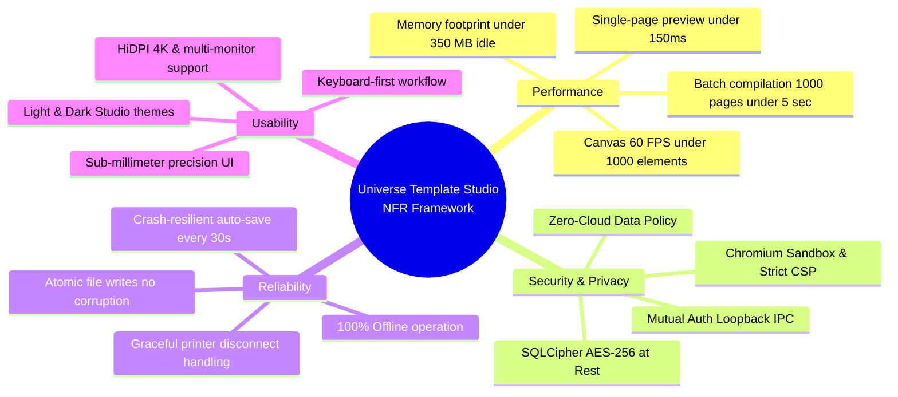
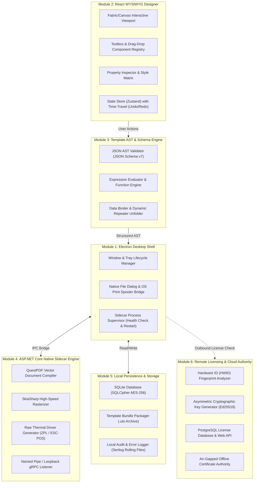
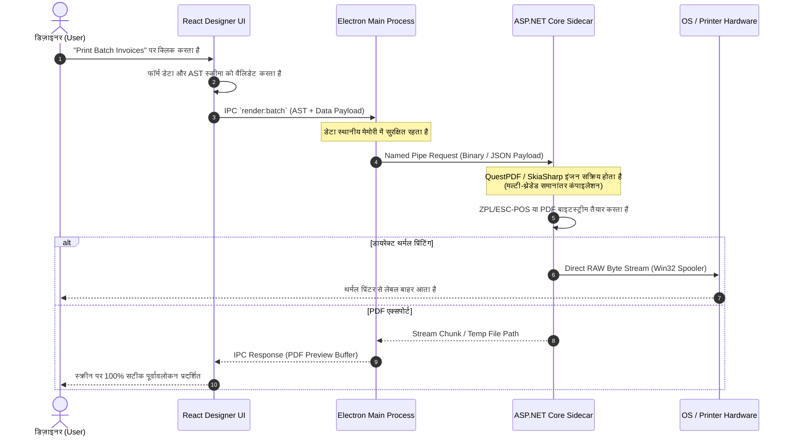
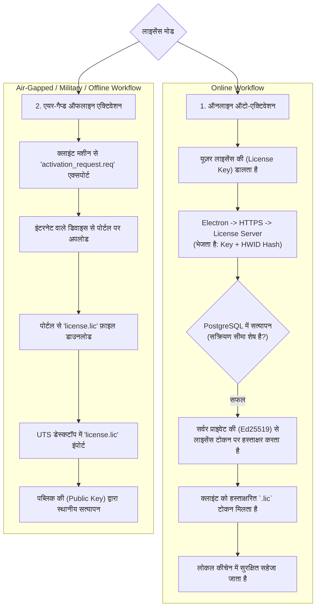
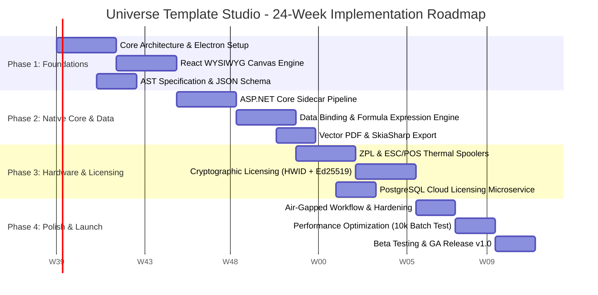

# Software Architecture & Engineering Specification
## Project: Universe Template Studio (UTS)
**Document Version:** 1.0.0  
**Status:** Approved for Architecture Baseline  
**Classification:** Proprietary & Confidential  
**Target Environment:** Cross-Platform Desktop (Windows / macOS / Linux) & Remote Licensing Cloud  

---

## 1. Executive Summary & Vision (कार्यकारी सारांश एवं दृष्टि)

### 1.1 Vision Statement (विज़न)
**Universe Template Studio (UTS)** एक अगली पीढ़ी का (Next-Generation), उच्च-प्रदर्शन (High-Performance), **Local-First / Offline-Centric Desktop Template Designer** और **Document Generation Engine** है। यह बिज़नेस उपयोगकर्ताओं, डेवलपर्स और एंटरप्राइज़ ऑपरेशन्स को जटिल व्यावसायिक दस्तावेज़ों (जैसे: GST Invoices, E-Way Bills, Barcode/RFID Tags, Shipping Labels, Tax Invoices, Payroll Receipts, Official Certificates) को विज़ुअली डिज़ाइन करने, डेटा स्रोतों से डायनामिक रूप से मैप करने और उच्च गति पर रेंडर करने की क्षमता प्रदान करता है।

### 1.2 Core Philosophy: Local-First & Zero-Cloud Business Data
पारंपरिक क्लाउड-आधारित डिज़ाइन टूल्स (जैसे Canva या SaaS रिपोर्टिंग टूल्स) में बिज़नेस डेटा (ग्राहक विवरण, वित्तीय आंकड़े, इनवॉइस आइटम्स) तीसरे पक्ष के सर्वर पर अपलोड होता है। **Universe Template Studio का आधारभूत सिद्धांत (Foundational Tenet) है: "Zero-Cloud Data Boundary"**।
* **100% ऑन-प्रिमाइसेस प्रोसेसिंग:** डिज़ाइनिंग, डेटा-बाइंडिंग, डेटाबेस क्वेरीज़, और फ़ाइनल PDF/प्रिंट रेंडरिंग पूरी तरह से उपयोगकर्ता के स्थानीय कंप्यूटर (Local PC / LAN) पर निष्पादित होती है।
* **क्लाउड का सीमित उपयोग:** क्लाउड का उपयोग **केवल और केवल** क्रिप्टोग्राफ़िक सॉफ़्टवेयर लाइसेंस सत्यापन (License Handshake) और सॉफ़्टवेयर अपडेट चेकिंग के लिए होता है। बिज़नेस डेटा या टेम्प्लेट स्कीमा कभी भी स्थानीय मशीन की सीमा से बाहर नहीं जाता।

---

## 2. Technology Stack & Architectural Justification (प्रौद्योगिकी चयन एवं औचित्य)

सिस्टम को आधुनिक वेब प्रौद्योगिकियों के समृद्ध UI अनुभव और नेटिव सिस्टम्स की अत्यधिक गति (raw computational speed) के संयोजन के रूप में डिज़ाइन किया गया है:

| कम्पोनेंट (Layer) | चुनी गई तकनीक (Technology) | उपयोग का दायरा (Scope) | चयन का तकनीकी औचित्य (Rationale) |
| :--- | :--- | :--- | :--- |
| **Desktop Shell** | **Electron (v30+)** | क्रॉस-प्लेटफ़ॉर्म डेस्कटॉप फ्रेमवर्क | नेटिव OS APIs (File System, Printer Spooler, Hardware USB Devices) और ऑटो-अपडेटर का सुरक्षित एक्सेस। |
| **Frontend Designer UI** | **React 18 / TypeScript / Canvas-SVG** | WYSIWYG कैनवास और डिज़ाइन टूल्स | 60fps इंटरेक्टिव रेंडरिंग, समृद्ध इकोसिस्टम, मॉड्यूलर UI कम्पोनेंट्स और रिएक्टिव स्टेट मैनेजमेंट (Zustand)। |
| **Native High-Performance Core** | **ASP.NET Core / .NET 8 AOT (Sidecar)** | *Only where needed* (भारी कम्प्यूटेशन एवं बैच रेंडरिंग) | भारी PDF रेंडरिंग, थर्मल प्रिंटर (ZPL/ESC-POS) बाइनरी जनरेशन, मल्टी-थ्रेडेड बैच कंपाइलेशन जिसमें Node.js धीमा पड़ जाता है। |
| **Local Persistence Layer** | **SQLite 3 + SQLCipher** | स्थानीय डेटा स्टोरेज (Local Desktop) | ज़ीरो-कॉन्फ़िगरेशन, एम्बेडेड, ACID-अनुरूप, AES-256 बिट एन्क्रिप्टेड लोकल स्टोरेज (टेम्प्लेट्स, सेटिंग्स, ऑडिट ट्रेल्स)। |
| **Remote License Server** | **PostgreSQL 16 + ASP.NET Core API** | सेंट्रलाइज़्ड लाइसेंसिंग क्लस्टर | उच्च समवर्ती क्षमता (High Concurrency), JSONB सपोर्ट (HWID फिंगरप्रिंट ऑडिट), ACID सुरक्षा और रॉक-सॉलिड विश्वसनीयता। |

---

## 3. High-Level Architecture & System Boundaries (उच्च-स्तरीय आर्किटेक्चर एवं सिस्टम सीमाएं)

सिस्टम को दो प्राथमिक क्षेत्रों (Boundaries) में विभाजित किया गया है:
1. **Local Desktop Workspace (The Secure Perimeter):** जहाँ 100% बिज़नेस ऑपरेशन्स होते हैं।
2. **Central License Cloud (The Trust Authority):** जहाँ केवल लाइसेंस टोकन और मशीन सिग्नेचर प्रोसेस होते हैं।

```mermaid
graph TB
    subgraph Central_Cloud ["Central Cloud Authority (License Only)"]
        LicAPI["Licensing Microservice<br/>(ASP.NET Core / Web API)"]
        LicDB[("PostgreSQL 16<br/>License & HWID Vault")]
        LicAPI <--> LicDB
    end

    subgraph Local_Desktop ["Local Desktop Machine (Zero-Cloud Data Boundary)"]
        subgraph Electron_Container ["Electron Desktop Shell (Safe Sandbox)"]
            Renderer["React 18 WYSIWYG Canvas<br/>(TypeScript + Zustand + Canvas/SVG)"]
            Preload["Secure Context Bridge<br/>(Preload / Context Isolation)"]
            MainProc["Electron Main Process<br/>(OS Window, Native Menu, Shell)"]
            
            Renderer <-->|Secure IPC| Preload
            Preload <-->|Protected Channel| MainProc
        end

        subgraph Local_Storage ["Local Persistence (Local Only)"]
            SQLite[("SQLite + SQLCipher<br/>(AES-256 Encrypted)")]
            TemplateFiles["Local Template Bundles<br/>(*.uts / JSON AST)"]
        end

        subgraph Native_Sidecar ["ASP.NET Core .NET 8 Native Sidecar (Local Loopback)"]
            IPC_Server["Local Loopback / Named Pipe Server"]
            DocEngine["Document Compiler<br/>(QuestPDF / SkiaSharp)"]
            PrintEngine["Thermal & Vector Spooler<br/>(Raw ESC/POS, ZPL, Win32 Print)"]
            
            IPC_Server --> DocEngine
            IPC_Server --> PrintEngine
        end

        MainProc <-->|Loopback IPC / Named Pipe| IPC_Server
        MainProc <-->|Local Read/Write| SQLite
        MainProc <-->|File System| TemplateFiles
        DocEngine -->|Direct OS Print Stream| Printer[(Printers: Desktop / Thermal)]
        DocEngine -->|Local File Stream| ExportFiles[("Exported PDFs, Images, ZPL")]
    end

    %% Network Boundary
    MainProc -.->|HTTPS / Mutual TLS<br/>Licensing Handshake ONLY<br/>(Machine HWID & Token)| LicAPI

    classDef cloud fill:#ffebee,stroke:#c62828,stroke-width:2px;
    classDef local fill:#e8f5e9,stroke:#2e7d32,stroke-width:2px;
    classDef sidecar fill:#e1f5fe,stroke:#0277bd,stroke-width:2px;
    class LicAPI,LicDB cloud;
    class Renderer,Preload,MainProc,SQLite,TemplateFiles local;
    class IPC_Server,DocEngine,PrintEngine sidecar;
```

---

## 4. Data Privacy & Zero-Cloud Architecture (डेटा गोपनीयता एवं सुरक्षा गारंटी)

### 4.1 The Zero-Cloud Data Boundary (गोपनीयता नियम)
Universe Template Studio सख्त **"Zero-Knowledge Local Boundary"** प्रोटोकॉल लागू करता है:

```mermaid
flowchart LR
    subgraph Prohibited_Zone ["Forbidden from Outbound Network"]
        D1["ग्राहक का नाम एवं पता (Customer PII)"]
        D2["इनवॉइस व वित्तीय डेटा (Financial Records)"]
        D3["लोकल डेटाबेस क्रेडेंशियल्स (DB Passwords)"]
        D4["टेम्प्लेट का लेआउट व बिज़नेस लॉजिक (AST)"]
        D5["जनरेट किए गए दस्तावेज़ (Generated PDFs)"]
    end

    subgraph Allowed_Zone ["Allowed Outbound Network (Encrypted HTTPS)"]
        L1["मशीन हैश (Hardware ID Hash)"]
        L2["लाइसेंस की (License Activation Key)"]
        L3["सॉफ़्टवेयर संस्करण (Software Version Tag)"]
    end

    Wall{"Strict CSP & Network Sandbox"}
    
    Prohibited_Zone -->|BLOCKED by Sandbox| Wall
    Wall --> Internet((Public Internet))
    Allowed_Zone -->|PERMITTED (Mutual Auth)| Internet
```

### 4.2 Security Controls & Sandboxing
1. **Chromium Network Sandboxing:** Electron का `webPreferences` हमेशा `contextIsolation: true`, `nodeIntegration: false`, और `sandbox: true` पर सेट रहेगा।
2. **Content Security Policy (CSP):** Renderer लेयर पर CSP सख्ती से बाहरी नेटवर्क कॉल्स (`connect-src 'none'`) को ब्लॉक करती है ताकि कोई दुर्भावनापूर्ण स्क्रिप्ट डेटा लीक न कर सके।
3. **Local Loopback Communication:** Electron और ASP.NET Core साइडकार के बीच का संचार केवल लोकल Named Pipes (Windows) या लोकल Unix Domain Sockets (Linux/macOS) के माध्यम से होता है, जिसमें हर सत्र (session) के लिए एक क्रिप्टोग्राफ़िक ऑथेंटिकेशन टोकन (Session Secret) आवश्यक होता है।
4. **Data at Rest Encryption:** SQLite डेटाबेस SQLCipher (256-bit AES) द्वारा एन्क्रिप्टेड रहता है, जिसकी एन्क्रिप्शन की उपयोगकर्ता के OS की नेटिव कीचेन (Windows Credential Manager / DPAPI, macOS Keychain) में सुरक्षित रहती है।

---

## 5. Functional Requirements (फंक्शनल आवश्यकताएं)

### FR-1: Visual Template Designer (WYSIWYG Canvas)
* **1.1 Multi-Unit Precision Canvas:** मिलीमीटर (mm), इंच (in), सेंटीमीटर (cm), और पिक्सल (px) का सटीक रूपांतरण (Sub-millimeter precision 0.01mm)।
* **1.2 Layout & Snap Guides:** चुम्बकीय ग्रिड स्नैपिंग (Magnetic Grid), ऑब्जेक्ट-टू-ऑब्जेक्ट गाइडलाइन्स, ऑटो-सेंटरिंग और स्मार्ट अलाइनमेंट।
* **1.3 Multi-Page & Orientation Management:** सिंगल-पेज लेबल्स (थर्मल) से लेकर मल्टी-पेज रिपोर्ट्स (A4, Letter, Legal) का समर्थन; लैंडस्केप/पोर्ट्रेट ओरिएंटेशन।
* **1.4 Layer Hierarchy & Canvas Operations:** Z-इंडेक्स लेयरिंग (Bring Forward/Send Backward), लेयर लॉकिंग, लेयर हाइडिंग, ग्रुपिंग/अनग्रुपिंग, और असीमित Undo/Redo (Cmd/Ctrl+Z)।

### FR-2: Component & Element Ecosystem
* **2.1 Typography & Rich Text:** सिस्टम फॉन्ट्स, कस्टम TTF/OTF/WOFF2 फ़ॉन्ट एम्बेडिंग, ऑटो-टेक्स्ट रैपिंग, रोटेशन (0°, 90°, 180°, 270°), और डायनामिक टेक्स्ट ओवरफ्लो हैंडलिंग।
* **2.2 Barcode & 2D Matrix Engine:**
  * **1D Barcodes:** Code 128 (A/B/C), EAN-13, EAN-8, UPC-A, Code 39, ITF-14।
  * **2D Codes:** QR Code (कस्टम ECC स्तर: L, M, Q, H), GS1-DataMatrix, PDF417, Aztec।
  * वेक्टर रेंडरिंग ताकि प्रिंटिंग के समय बारकोड कभी धुंधला (blurry) न हो।
* **2.3 Vector Shapes & Images:** रेखाएँ (Line), आयत (Rectangle/Rounded), अंडाकार (Ellipse), SVG वेक्टर्स, और स्थानीय इमेज फ़ाइल्स (PNG, JPG, WebP) सुरक्षित बेस64/पाथ लोडिंग के साथ।
* **2.4 Dynamic Data Tables & Repeaters:** हेडर, बॉडी, ऑल्टरनेट रो स्टाइलिंग, फ़ूटर, ऑटो-पेजिंग (यदि डेटा 1 पेज से अधिक हो जाए तो स्वतः अगला पेज जोड़ना)।

### FR-3: Data Modeling & Expression Engine
* **3.1 Schema Definition:** JSON Schema द्वारा संचालित डेटा संरचना (Variables, Lists, Nested Objects)।
* **3.2 In-Memory Mock Data:** डिज़ाइन समय पर पूर्वावलोकन (Preview) देखने के लिए डमी JSON डेटा लोडर।
* **3.3 Formula & Expression Parser:**
  * गणितीय गणनाएँ: `Sum(Items.Total)`, `TaxRate * Amount`।
  * स्ट्रिंग संचालन: `Concat(FirstName, ' ', LastName)`, `ToUpper()`, `SubStr()`।
  * तिथिकरण व मुद्रा फ़ॉर्मेटिंग: `FormatDate(Date, 'DD-MM-YYYY')`, `FormatCurrency(Amount, 'INR')`।
  * सशर्त लॉजिक (Conditional Rendering): `If(Total > 10000, 'VIP', 'Regular')`, हिडन-इफ़ कंडीशन्स।
* **3.4 Local Data Source Connectors:** स्थानीय CSV, Excel (.xlsx), SQLite, या JSON फ़ाइलों से डायरेक्ट डेटा इंपोर्ट।

### FR-4: Document Compilation & Rendering Engine
* **4.1 Vector PDF Generation:** 300 DPI प्रिंट-रेडी वेक्टराइज़्ड PDF, CMYK/RGB रंग स्थान, एम्बेडेड फॉन्ट्स, PDF/A-3 अनुपालन।
* **4.2 Direct Thermal Printer Streams:**
  * **ZPL II (Zebra Programming Language):** ज़ेब्रा और संगत लेबल प्रिंटर्स के लिए नेटिव ZPL कमांड जेनरेशन।
  * **ESC/POS:** थर्मल रसीद प्रिंटर (58mm, 80mm POS रसीदें) के लिए शुद्ध बाइनरी स्ट्रीम (कट, ड्रॉर ओपन, बोल्ड, डेंसिटी)।
* **4.3 Image Rasterization:** हाई-रेज़ोल्यूशन PNG/JPG एक्सपोर्ट (कस्टम DPI 72 से 600 तक)।
* **4.4 Batch Generation Pipeline:** 10,000+ इनवॉइस/लेबल्स का मल्टी-थ्रेडेड समानांतर कंपाइलेशन स्थानीय मेमोरी/डिस्क पर।

### FR-5: Template Management & Packaging
* **5.1 Unified File Format (`.uts`):** टेम्प्लेट को एक सिंगल संपीड़ित/संरचित फ़ाइल में सहेजना जिसमें लेआउट स्कीमा, फॉन्ट्स, एम्बेडेड एसेट्स और मेटाडेटा शामिल हों।
* **5.2 Versioning & Local History:** प्रत्येक सुरक्षित संपादन पर स्थानीय Git-जैसी स्नैपशॉट हिस्ट्री ताकि उपयोगकर्ता किसी भी पिछले संस्करण पर रोलबैक कर सके।

---

## 6. Non-Functional Requirements (नॉन-फंक्शनल आवश्यकताएं)



| श्रेणी | मानक (Metric) | लक्ष्य विनिर्देश (Target Specification) |
| :--- | :--- | :--- |
| **Canvas Responsiveness** | UI Render Latency | किसी भी ड्रैग/रीसाइज़ ऑपरेशन पर < 16.6ms (60 FPS)। |
| **Compilation Speed** | Single Document Render | डेटा बाइंडिंग से फ़ाइनल PDF < 150 मिलीसेकंड। |
| **Batch Throughput** | Bulk Print/PDF Generation | ASP.NET Core साइडकार पर 200+ पेजेज़ प्रति सेकंड (A4 Invoices)। |
| **Cold Startup Time** | Application Launch | सिस्टम बूट से इंटरैक्टिव कैनवास < 2.5 सेकंड। |
| **Storage Footprint** | Installer & Dependencies | टोटल इंस्टॉलर साइज़ < 120 MB (AOT संकलित बाइनरी के साथ)। |
| **Availability / Offline** | Network Disconnection | इंटरनेट न होने पर भी 100% कार्यक्षमता (30-दिन ऑफलाइन ग्रेस)। |
| **Fault Tolerance** | System Crash Recovery | प्रत्येक संपादन पर ऑटो-जर्नल; सिस्टम क्रैश होने पर ज़ीरो डेटा लॉस। |

---

## 7. Modular Architecture Breakdown (विस्तृत मॉड्यूल संरचना)

Universe Template Studio को 6 मुख्य मॉड्यूल्स में विभाजित किया गया है:



### 7.1 Module Deep-Dive

#### Module 1: Electron Desktop Shell
* **Window Lifecycle:** विंडो का निर्माण, सिस्टम ट्रे एकीकरण, मिनिमम/मैक्सिमम साइज़ कंस्ट्रेंट्स और नेटिव मेनू बार।
* **Sidecar Supervisor:** जब Electron शुरू होता है, यह पृष्ठभूमि में छिपी हुई (headless) ASP.NET Core साइडकार निष्पादन योग्य फ़ाइल (`uts-core.exe`) को बूट करता है, इसकी हेल्थ को मॉनिटर करता है और किसी भी अप्रत्याशित विफलता पर इसे स्वतः पुनः आरंभ करता है।
* **Context Isolation Bridge:** `preload.js` के माध्यम से केवल स्वीकृत, सख्त रूप से टाइप किए गए IPC मेथड्स ही रेंडरर प्रोसेस को उपलब्ध कराए जाते हैं।

#### Module 2: React WYSIWYG Designer UI
* **Canvas Engine:** अनुकूलित HTML5 Canvas / SVG रेंडरर जो स्केलिंग, रोटेशन, स्नैपिंग और ग्रिड लाइनों को हैंडल करता है।
* **Property Inspector:** सिलेक्टेड एलिमेंट के गुणधर्म (X, Y, चौड़ाई, ऊँचाई, रंग, पैडिंग, बॉर्डर्स, फ़ॉन्ट, बाइंडिंग फ़ील्ड) को रियल-टाइम में अपडेट करता है।
* **State Management:** Zustand-आधारित इम्यूटेबल स्टेट ट्री, जो प्रत्येक कैनवास म्यूटेशन का स्नैपशॉट रखता है जिससे शून्य विलंबता (zero-lag) पूर्ववत/पुनः करना (Undo/Redo) संभव होता है।

#### Module 3: Template AST & Schema Engine
* **Abstract Syntax Tree (AST):** प्रत्येक टेम्प्लेट को एक मानकीकृत, वर्ज़न-नियंत्रित JSON ट्री के रूप में संग्रहीत किया जाता है:
```json
{
  "$schema": "https://schema.universetemplatestudio.com/v1/template.json",
  "metadata": {
    "id": "tpl_inv_089f",
    "name": "Standard GST Tax Invoice",
    "version": 2,
    "unit": "mm",
    "pageSize": { "width": 210, "height": 297, "orientation": "portrait" }
  },
  "bindings": {
    "InvoiceNumber": { "type": "string", "mock": "INV-2026-0042" },
    "Items": { "type": "array", "mock": [ { "sku": "A1", "price": 450 } ] }
  },
  "tree": [
    {
      "id": "el_hdr_1",
      "type": "text",
      "bounds": { "x": 10, "y": 15, "width": 80, "height": 10 },
      "style": { "fontSize": 16, "fontWeight": "bold", "color": "#111827" },
      "content": "TAX INVOICE"
    },
    {
      "id": "el_qr_1",
      "type": "qrcode",
      "bounds": { "x": 160, "y": 10, "width": 35, "height": 35 },
      "data": "https://einvoice.gov.in/verify?id={{InvoiceNumber}}"
    }
  ]
}
```

#### Module 4: ASP.NET Core Native Sidecar Engine
* **कम्प्यूटेशनल रोल:** जटिल रेंडरिंग के लिए केवल .NET 8 AOT का उपयोग किया जाता है। जब उपयोगकर्ता "Export 5,000 Invoices" या "Print Thermal Batch" पर क्लिक करता है, तो Electron केवल JSON AST और डेटा ऐरे साइडकार को भेजता है।
* **QuestPDF & SkiaSharp Integration:** C# कोड मल्टी-कोर CPU का उपयोग करके समानांतर रूप से वेक्टराइज्ड पेजों का निर्माण करता है, जिससे मेमोरी ओवरहेड नगण्य रहता है।
* **Direct Hardware Spooler:** Windows `win32print` या Linux CUPS के माध्यम से थर्मल प्रिंटर के कच्चे पोर्ट (RAW 9100 / USB) पर ESC/POS या ZPL बाइट्स को सीधे इंजेक्ट करता है।

#### Module 5: Local Persistence & Storage
* **SQLite Database:** टेम्प्लेट मेटाडेटा, रीसेंट फ़ाइल्स, यूज़र प्रेफरेंसेज़, और लोकल डेटा-कनेक्टर कॉन्फ़िगरेशन को स्टोर करता है।
* **SQLCipher AES-256:** यह सुनिश्चित करता है कि यदि डिवाइस चोरी हो जाए, तब भी लोकल डेटाबेस फ़ाइल को डिक्रिप्ट नहीं किया जा सकता।

#### Module 6: Remote Licensing & Cloud Authority
* **PostgreSQL Schema:** लाइसेंस की स्थिति (Active, Suspended, Expired), सक्रियण सीमा (Max Activations), अधिकृत हार्डवेयर फिंगरप्रिंट्स, और डिजिटल रूप से हस्ताक्षरित टोकन स्टोर करता है।
* **Security Responsibility:** किसी भी बिज़नेस डेटा को नहीं छूता। केवल लाइसेंस और क्रिप्टोग्राफिक टोकन का प्रबंधन करता है।

---

## 8. Inter-Process Communication (IPC) & Execution Flows

### 8.1 Document Compilation & Print Flow (अनुक्रम आरेख)

जब कोई उपयोगकर्ता टेम्प्लेट का पूर्वावलोकन या प्रिंट अनुरोध करता है, तो डेटा प्रवाह इस प्रकार होता है:



---

## 9. Cryptographic Licensing & Hardware Node-Locking (लाइसेंसिंग प्रणाली)

Universe Template Studio एंटरप्राइज़ पायरेसी सुरक्षा और एयर-गैप्ड वातावरण दोनों का समर्थन करने के लिए **Asymmetric Cryptography (Ed25519)** और **Hardware Fingerprinting** का उपयोग करता है।

### 9.1 Hardware Fingerprint (HWID) Engine
क्लाइंट मशीन की विशिष्ट पहचान करने के लिए एक अपरिवर्तनीय हैश उत्पन्न किया जाता है:
$$\text{HWID} = \text{HMAC-SHA256}\Big(\text{Salt}, \text{CPU\_ID} \,\|\, \text{Motherboard\_UUID} \,\|\, \text{Primary\_MAC\_Address}\Big)$$
* यह पहचानकर्ता गैर-प्रतिवर्ती (irreversible) होता है, जिससे उपयोगकर्ता के व्यक्तिगत हार्डवेयर विवरण कभी उजागर नहीं होते।

### 9.2 Licensing Modes



### 9.3 Anti-Tamper & Offline Grace Period Logic
* **पब्लिक-की सत्यापन:** एप्लिकेशन के अंदर सेंट्रल सर्वर की **Ed25519 Public Key** हार्डकोडेड होती है। क्लाइंट सॉफ़्टवेयर बिना किसी नेटवर्क कॉल के भी लाइसेंस फ़ाइल के हस्ताक्षर (Digital Signature) और HWID का मिलान कर सकता है।
* **30-दिन ग्रेस पीरियड (Grace Period):** ऑनलाइन लाइसेंसिंग वाले उपयोगकर्ता यदि इंटरनेट से कट भी जाते हैं, तो सॉफ़्टवेयर 30 दिनों तक बिना किसी रुकावट के पूरी क्षमता से काम करता रहेगा। 30 दिनों के बाद ही सिस्टम को एक बार पिंग की आवश्यकता होती है।
* **सिस्टम क्लॉक टैम्पर डिटेक्शन:** उपयोगकर्ता द्वारा सिस्टम घड़ी को पीछे करने (Rollback) से बचने के लिए, SQLite में प्रत्येक ऑपरेशन पर मोनोटोनिक टाइमस्टैम्प्स (Monotonic State Hashes) सहेजे जाते हैं। यदि वर्तमान समय पिछले रिकॉर्ड किए गए समय से पूर्व पाया जाता है, तो सॉफ़्टवेयर क्लॉक सिंक त्रुटि दिखाता है।

---

## 10. Database Schema (PostgreSQL License Server & SQLite Local Store)

### 10.1 Remote PostgreSQL License Server Schema
सेंट्रल लाइसेंस सर्वर का स्कीमा हल्का, सुरक्षित और केवल लाइसेंसिंग के लिए समर्पित है:

```sql
-- PostgreSQL Remote Licensing Database
CREATE TABLE organizations (
    id UUID PRIMARY KEY DEFAULT gen_random_uuid(),
    name VARCHAR(255) NOT NULL,
    contact_email VARCHAR(255) UNIQUE NOT NULL,
    created_at TIMESTAMPTZ DEFAULT CURRENT_TIMESTAMP
);

CREATE TABLE license_tiers (
    id VARCHAR(50) PRIMARY KEY, -- 'COMMUNITY', 'PRO_SINGLE', 'ENTERPRISE_UNLIMITED'
    max_nodes INT NOT NULL DEFAULT 1,
    allow_thermal_drivers BOOLEAN DEFAULT TRUE,
    allow_batch_rendering BOOLEAN DEFAULT TRUE,
    is_airgap_eligible BOOLEAN DEFAULT FALSE
);

CREATE TABLE licenses (
    id UUID PRIMARY KEY DEFAULT gen_random_uuid(),
    license_key VARCHAR(64) UNIQUE NOT NULL, -- e.g. UTS-8942-F19A-443B-998C
    org_id UUID REFERENCES organizations(id) ON DELETE CASCADE,
    tier_id VARCHAR(50) REFERENCES license_tiers(id),
    status VARCHAR(20) NOT NULL DEFAULT 'ACTIVE', -- 'ACTIVE', 'REVOKED', 'EXPIRED'
    expires_at TIMESTAMPTZ,
    max_activations INT NOT NULL DEFAULT 1,
    created_at TIMESTAMPTZ DEFAULT CURRENT_TIMESTAMP
);

CREATE TABLE license_activations (
    id UUID PRIMARY KEY DEFAULT gen_random_uuid(),
    license_id UUID REFERENCES licenses(id) ON DELETE CASCADE,
    hwid_hash VARCHAR(64) NOT NULL, -- SHA256 Hash of client hardware
    friendly_name VARCHAR(100),     -- e.g. "Billing-Counter-01"
    last_heartbeat TIMESTAMPTZ DEFAULT CURRENT_TIMESTAMP,
    is_revoked BOOLEAN DEFAULT FALSE,
    activated_at TIMESTAMPTZ DEFAULT CURRENT_TIMESTAMP,
    CONSTRAINT unique_license_hwid UNIQUE (license_id, hwid_hash)
);
```

### 10.2 Local SQLite Schema (On-Premises Client Database)
स्थानीय डेस्कटॉप पर संग्रहीत स्कीमा:

```sql
-- SQLite Local Encrypted Store (SQLCipher)
CREATE TABLE local_app_settings (
    key TEXT PRIMARY KEY,
    value TEXT NOT NULL,
    updated_at DATETIME DEFAULT CURRENT_TIMESTAMP
);

CREATE TABLE local_templates (
    id TEXT PRIMARY KEY,            -- UUID v4
    name TEXT NOT NULL,
    description TEXT,
    category TEXT,
    ast_json TEXT NOT NULL,         -- JSON Abstract Syntax Tree
    preview_thumbnail BLOB,         -- PNG WebP Thumbnail
    version INTEGER NOT NULL DEFAULT 1,
    created_at DATETIME DEFAULT CURRENT_TIMESTAMP,
    updated_at DATETIME DEFAULT CURRENT_TIMESTAMP
);

CREATE TABLE template_revisions (
    id INTEGER PRIMARY KEY AUTOINCREMENT,
    template_id TEXT NOT NULL,
    version INTEGER NOT NULL,
    ast_json TEXT NOT NULL,
    commit_message TEXT,
    created_at DATETIME DEFAULT CURRENT_TIMESTAMP,
    FOREIGN KEY(template_id) REFERENCES local_templates(id) ON DELETE CASCADE
);

CREATE TABLE local_data_sources (
    id TEXT PRIMARY KEY,
    name TEXT NOT NULL,
    source_type TEXT NOT NULL,       -- 'JSON_MOCK', 'CSV_FILE', 'SQLITE_LOCAL'
    connection_config_encrypted TEXT,-- Encrypted credentials
    cached_schema TEXT
);
```

---

## 11. Project Roadmap & Delivery Timeline (रोडमैप एवं समय-सीमा)

प्रोजेक्ट को 24 हफ्तों (6 महीने) के 4 प्रमुख चरणों में निष्पादित किया जाएगा:



### 11.1 Detailed Phase Breakdown

#### Phase 1: Foundations & Visual Designer (सप्ताह 1 – 6)
* **डिलीवेरेबल्स:**
  1. Electron + React + TypeScript का सुरक्षित शेल (Sandbox + CSP)।
  2. 60 FPS WYSIWYG कैनवास (ड्रैग, रीसाइज़, रोटेट, स्नैप टू ग्रिड, ज़ूम/पैन)।
  3. बेसिक कम्पोनेंट्स: टेक्स्ट, रेक्टेंगल, इमेज, 1D/2D बारकोड्स (QR Code, Code 128)।
  4. अनडू/रीडू (Undo/Redo) और लेयर मैनेजमेंट।
  5. JSON AST स्कीमा v1.0 का मानकीकरण।

#### Phase 2: Native Sidecar & Dynamic Data Engine (सप्ताह 7 – 12)
* **डिलीवेरेबल्स:**
  1. .NET 8 AOT Sidecar का निर्माण और Named Pipe IPC लूपबैक संचार।
  2. डायनामिक फॉर्मूला पार्सर (Math, String formatting, Currency formatting)।
  3. डेटा रिपीटर और ऑटो-पेजिनेशन टेबल्स (मल्टी-पेज स्प्लिटिंग लॉजिक)।
  4. QuestPDF / SkiaSharp द्वारा 300 DPI वेक्टराइज्ड PDF एक्सपोर्ट।
  5. स्थानीय SQLite डेटाबेस और `.uts` टेम्प्लेट बंडल एक्सपोर्ट/इंपोर्ट।

#### Phase 3: Hardware Print Engines & Remote Licensing (सप्ताह 13 – 18)
* **डिलीवेरेबल्स:**
  1. नेटिव थर्मल प्रिंटिंग: ZPL II (Zebra) और ESC/POS रॉ बाइनरी स्पूलर।
  2. डायरेक्ट OS प्रिंटर डायलॉग और बिना डायलॉग वाली साइलेंट प्रिंटिंग।
  3. मशीन फिंगरप्रिंटिंग इंजन (HWID Generation)।
  4. Ed25519 क्रिप्टोग्राफ़िक सिग्नेचर इंफ्रास्ट्रक्चर।
  5. रिमोट ASP.NET Core + PostgreSQL लाइसेंस सर्वर की तैनाती।

#### Phase 4: Enterprise Hardening & General Availability (सप्ताह 19 – 24)
* **डिलीवेरेबल्स:**
  1. एयर-गैप्ड (पूर्णतः ऑफलाइन) लाइसेंस एक्टिवेशन वर्कफ़्लो।
  2. 10,000+ इनवॉइस का बैच रेंडरिंग स्ट्रेस टेस्ट (रेंडर टाइम < 5 सेकंड प्रति 1,000 पेजेज़)।
  3. SQLCipher 256-bit AES डेटाबेस एन्क्रिप्शन।
  4. मल्टी-प्लेटफ़ॉर्म ऑटो-अपडेटर (Windows MSIX/NSIS, macOS DMG, Linux AppImage)।
  5. v1.0 GA (General Availability) रिलीज़ और दस्तावेज़ीकरण।

---

## 12. Risk Management & Mitigation Matrix (जोखिम प्रबंधन)

| जोखिम (Identified Risk) | प्रभाव (Impact) | संभावना (Probability) | शमन रणनीति (Mitigation Strategy) |
| :--- | :--- | :--- | :--- |
| **Electron & Sidecar Desynchronization** | उच्च (High) | मध्यम (Medium) | Electron मेन प्रोसेस में एक वॉचडॉग सुपरवाइज़र (Heartbeat Ping हर 2 सेकंड में)। क्रैश होने पर 500ms के भीतर ऑटो-रिस्टार्ट। |
| **Air-Gapped Machine Piracy** | उच्च (High) | निम्न (Low) | असिमेट्रिक Ed25519 डिजिटल हस्ताक्षर और एंटी-क्लॉक रोलबैक चेक्स। लाइसेंस फ़ाइल सीधे हार्डवेयर हैश से बंधी होगी। |
| **Large Batch Memory Leaks** | उच्च (High) | मध्यम (Medium) | .NET 8 AOT साइडकार में स्ट्रीमिंग पाइपलाइन (Streaming Pipeline) का उपयोग; RAM में संपूर्ण बैच रखने के बजाय डिस्क बफ़रिंग। |
| **Data Leakage via 3rd Party Plugins** | गंभीर (Critical) | निम्न (Low) | कड़ा Content Security Policy (CSP), `connect-src 'none'`, नोड इंटीग्रेशन डिसेबल्ड, और एक्सटर्नल नेटवर्क सैंडबॉक्सिंग। |
| **Thermal Printer Command Incompatibility** | मध्यम (Medium) | उच्च (High) | जेनेरिक ESC/POS और ZPL फॉलबैक एमुलेटर; डिवाइस के अनुसार कस्टमाइज़ेबल प्रिंटर प्रोफाइल्स (DPI, Cut, Feed offset)। |

---

## 13. Deliverables & Acceptance Criteria (अंतिम डिलीवेरेबल्स एवं स्वीकृति मानदंड)

1. **आर्किटेक्चर ब्लूप्रिंट:** यह संपूर्ण तकनीकी विनिर्देश दस्तावेज़।
2. **AST JSON Schema Definition:** टेम्प्लेट लेआउट और बाइंडिंग्स के लिए पूर्णतः वैलिडेटेड स्कीमा।
3. **Electron-React Frontend Client:** डेस्कटॉप UI और WYSIWYG कैनवास का सोर्स कोड और पैकेजिंग स्क्रिप्ट्स।
4. **.NET 8 Native Rendering Core:** साइडकार बाइनरी और प्रिंट/कंपाइल लाइब्रेरीज़।
5. **PostgreSQL License Service:** लाइसेंसिंग बैकएंड API और डेटाबेस माइग्रेशन स्क्रिप्ट्स।
6. **Hardware Test Suite:** थर्मल रसीद प्रिंटर, बारकोड स्कैनर और हाई-स्पीड लेज़र प्रिंटर टेस्ट सूट्स।

---
*End of Universe Template Studio Architecture Specification.*
