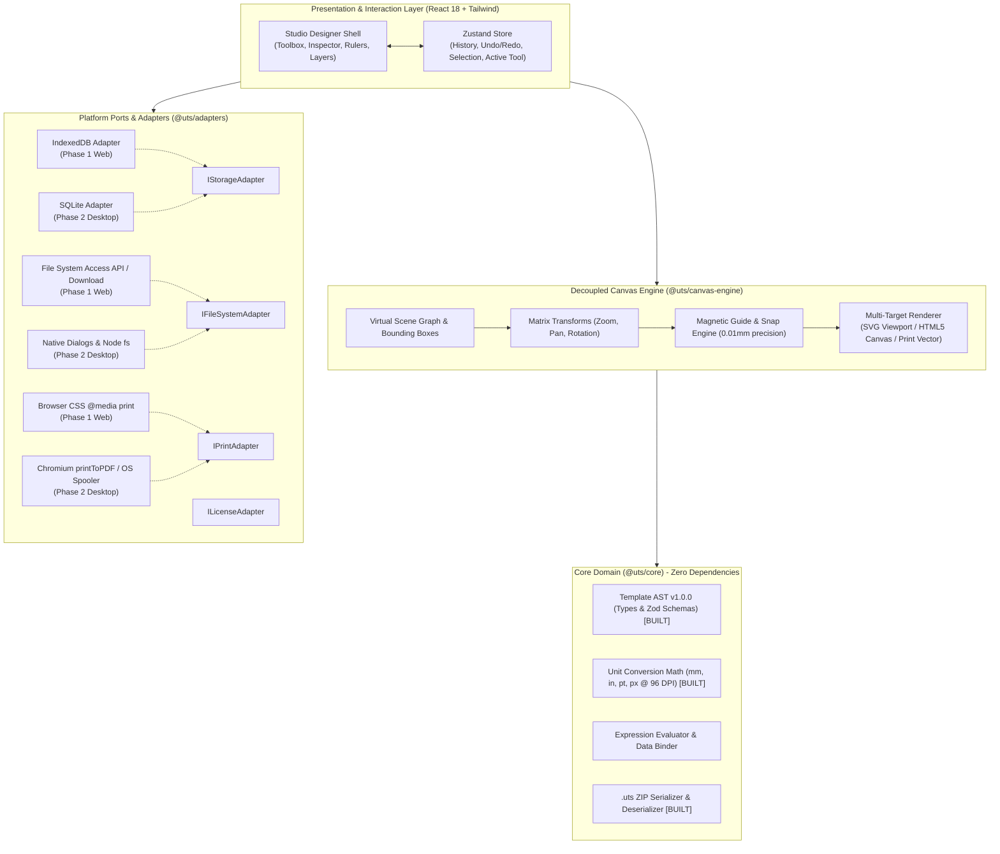

# Universe Template Studio (UTS) - Phase 1 Web-First Implementation Plan

**Author:** Antigravity Architecture Team  
**Status:** Task 1 Complete ✅ | Ready for Task 2 Approval  
**Strategy:** Web-First React + TypeScript, Portable `.uts` Archive, Decoupled AST, Future Electron Integration  

---

## Progress Dashboard

| Milestone / Task | Description | Status | Verification / Artifacts |
| :--- | :--- | :---: | :--- |
| **Task 1: Core Foundation** | pnpm monorepo scaffolding, `@uts/core` AST v1.0.0, Zod schemas, unit conversion math, `.uts` ZIP packager. | **DONE** ✅ | 16/16 Vitest tests passed (769ms). Clean `tsc -b` compilation. |
| **Task 2: Canvas Viewport & Math** | Interactive canvas viewport in React, sub-millimeter metric rulers (mm), grid lines, pan/zoom engine, coordinate transformation matrix. | **READY** ⏳ | Next task awaiting approval. |
| **Task 3: Core Elements & Renderers** | Decoupled renderers for Text, Shapes, Images (embedded assets), and Barcodes (via `bwip-js`). | Backlog | Milestone 3 |
| **Task 4: Selection & Transform** | Multi-select lasso, 8-point resize handles, rotation handle, keyboard shortcuts (Delete, Arrow nudge, Undo/Redo). | Backlog | Milestone 4 |
| **Task 5: Snapping & Alignment** | Magnetic snap guides (edge-to-edge, center-to-center), distribution tools (align left/center/right). | Backlog | Milestone 5 |
| **Task 6: Property Inspector & Layers** | Right-hand property inspector panel (Geometry, Typography, Fill/Stroke, Barcode settings) and Layer management. | Backlog | Milestone 6 |
| **Task 7: Data Binding & Mock Data** | Variable interpolation `{{variable}}`, sample JSON mock data editor, live preview toggle. | Backlog | Milestone 7 |
| **Task 8: Trace Mode & File I/O** | PDF/Image background trace reference loader, Save `.uts` to local disk, Open `.uts` from disk, Web Print preview. | Backlog | Milestone 8 |

---

## A. Final Project Architecture

Universe Template Studio is designed using **Clean Hexagonal Architecture (Ports and Adapters)**. The Core AST, Business Logic, and Canvas Rendering are 100% agnostic of both the browser DOM and Electron.



---

## B. Monorepo / Folder Structure

```
universe-template-studio/
├── apps/
│   ├── web/                                # Phase 1: Primary Web-First Application
│   │   ├── src/
│   │   │   ├── components/
│   │   │   │   ├── shell/                  # TopBar, LeftBar, RightBar, StatusBar
│   │   │   │   ├── toolbox/                # Tool items (Text, Image, Shape, Barcode)
│   │   │   │   ├── canvas/                 # Viewport, Rulers, Guides, Overlay
│   │   │   │   ├── inspector/              # Property panels (Geometry, Typography, Style, Bindings)
│   │   │   │   ├── layers/                 # Layer list, visibility, locking, reordering
│   │   │   │   ├── databinding/            # Mock data viewer, field schema editor
│   │   │   │   └── modals/                 # Page Setup, Export Preview, Import Trace PDF
│   │   │   ├── hooks/                      # useHotkeys, useClipboard, useSnap
│   │   │   ├── store/                      # Zustand slices (templateSlice, uiSlice, historySlice)
│   │   │   ├── styles/                     # Tailwind CSS, globals, fonts
│   │   │   ├── App.tsx
│   │   │   └── main.tsx
│   │   ├── index.html
│   │   ├── vite.config.ts
│   │   ├── tailwind.config.ts
│   │   ├── package.json
│   │   └── tsconfig.json
│   │
│   └── desktop/                            # Phase 2: Electron Desktop Wrapper
│       ├── src/
│       │   ├── main/                       # Electron main process, windows, menu
│       │   │   ├── index.ts
│       │   │   ├── ipc-handlers.ts         # Native file dialogs, printToPDF
│       │   │   └── sqlite-manager.ts       # SQLite settings store (better-sqlite3)
│       │   └── preload/
│       │       ├── index.ts                # contextBridge.exposeInMainWorld('utsAPI', ...)
│       │       └── types.ts                # Strongly typed IPC contracts
│       ├── electron-builder.yml
│       ├── package.json
│       └── tsconfig.json
│
├── packages/
│   ├── core/                               # [BUILT & TESTED] AST, Schemas, Packager
│   │   ├── src/
│   │   │   ├── ast/                        # Template AST TypeScript types & Zod schemas
│   │   │   ├── math/                       # Physical units (mm/in/pt) to pixels, matrix helpers
│   │   │   ├── packager/                   # .uts ZIP container (JSZip serializer/deserializer)
│   │   │   └── index.ts
│   │   ├── test/                           # 16 Vitest tests (100% passing)
│   │   ├── package.json
│   │   └── tsconfig.json
│   │
│   ├── canvas-engine/                      # Library-Agnostic Canvas & Render Architecture
│   │   ├── src/
│   │   │   ├── scene/                      # Virtual scene graph, hit-testing
│   │   │   ├── transform/                  # Bounding box resize, rotate, translation
│   │   │   ├── snapping/                   # Magnetic alignment guides & thresholds
│   │   │   ├── renderers/                  # SVG and Canvas rendering implementations
│   │   │   ├── barcodes/                   # Barcode & QR vector generator (bwip-js wrapper)
│   │   │   └── index.ts
│   │   ├── package.json
│   │   └── tsconfig.json
│   │
│   └── adapters/                           # Platform Ports
│       ├── src/
│       │   ├── storage/                    # IStorageAdapter, WebStorageAdapter (IndexedDB)
│       │   ├── filesystem/                 # IFileSystemAdapter, WebFileSystemAdapter
│       │   ├── print/                      # IPrintAdapter, WebPrintAdapter
│       │   └── index.ts
│       ├── package.json
│       └── tsconfig.json
│
├── pnpm-workspace.yaml
├── package.json
└── tsconfig.base.json
```

---

## C. Task 2 Execution Plan: Visual Canvas Viewport & Coordinate Math

### Objective
Build the foundation of the visual designer: an interactive, high-performance viewport with zoom, pan, sub-millimeter rulers, and bidirectional coordinate transformation.

### Detailed Scope & Deliverables
1. **`@uts/canvas-engine` Viewport Math:**
   * Viewport state interface: `zoom` (0.1 to 10.0), `panX`, `panY`, `viewportWidth`, `viewportHeight`.
   * Coordinate transformation functions:
     * `screenToCanvas(screenPoint, viewportState, pageSettings)` $\rightarrow$ `{ x: number, y: number }` in mm.
     * `canvasToScreen(canvasPointMm, viewportState, pageSettings)` $\rightarrow$ `{ x: number, y: number }` in px.
   * Wheel zoom with cursor centering (zooming into mouse position rather than canvas origin).
   * Middle-click and spacebar drag panning.
2. **Interactive Metric Rulers (Top & Left):**
   * High-precision SVG rulers showing millimeters (`mm`).
   * Dynamic tick spacing based on zoom level:
     * High zoom ($> 200\%$): 1mm minor ticks, 5mm medium, 10mm major with labels.
     * Normal zoom ($100\%$): 5mm minor, 10mm major.
     * Low zoom ($< 50\%$): 25mm / 50mm major ticks to prevent visual clutter.
   * Cursor position indicator tracking live mouse position across rulers.
3. **Canvas Grid & Page Bounds:**
   * Visual page boundary with realistic shadow, margins guide, and optional magnetic dot/line grid (5mm or 10mm spacing).
   * Background checkerboard or neutral studio canvas workspace.
4. **Vite + React Setup in `apps/web`:**
   * Configure Tailwind CSS with dark/light studio theme.
   * Wire Zustand `useUIStore` (zoom, pan, activeTool, gridVisibility).
   * Wire Zustand `useTemplateStore` initialized with a default blank A4 / 4x6 Label template.
   * Mount and test the interactive viewport inside `apps/web`.

---

## D. Verification Plan for Task 2

### Automated Tests
* Unit tests in `@uts/canvas-engine` for:
  * Screen-to-canvas coordinate mapping at zoom levels 0.5x, 1x, 2x, and pan offsets.
  * Zoom center point preservation calculation.
  * Ruler tick interval calculation algorithms across scales.

### Manual / Browser Verification
* Run `pnpm --filter @uts/web dev`.
* Verify:
  1. Rulers display physical millimeters accurately aligned with page boundaries.
  2. Scrolling mouse wheel zooms in/out centered at mouse pointer.
  3. Spacebar + drag pans the canvas smoothly at 60 FPS.
  4. Status bar at bottom displays live mouse coordinates in millimeters (e.g. `X: 42.5 mm, Y: 110.2 mm`).

---

**Awaiting your approval.** Once approved, Task 2 will be implemented immediately.
